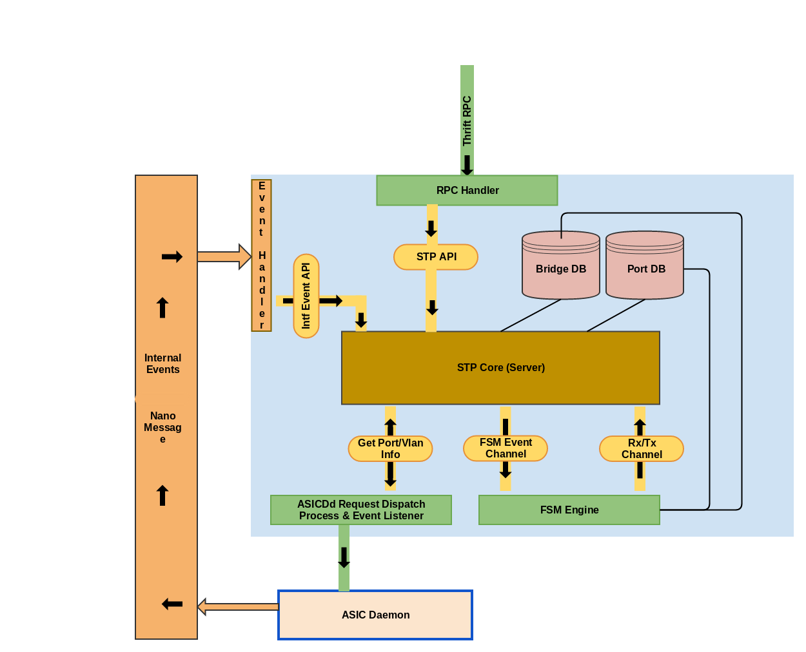

.. FlexSwitchSDK documentation master file, created by
   sphinx-quickstart on Mon Apr  4 12:27:04 2016.
   You can adapt this file completely to your liking, but it should at least
   contain the root `toctree` directive.

Detailed Architecture
=====================

System Architecture
^^^^^^^^^^^^^^^^^^^
.. image:: images/Software_Architecture.png

System Components
^^^^^^^^^^^^^^^^^
FlexSwitch software is a collection of L2, L3 protocols and some infrastructure components.
All FlexSwitch daemons provide IPC based APIs

Infrastructure Daemons
^^^^^^^^^^^^^^^^^^^^^^

Configuration Manager
"""""""""""""""""""""

The front-end to our RestBased API's.  Confd acts as a router to direct the API call to the correct Daemon or Database to the collect the appropriate information. 

System Daemon 
"""""""""""""

Monitors other system components and reports on their health. 

Routing Information Base
"""""""""""""""""""""""""

This is FlexSwitch's central location for all route information and manipulation.  Any IPv4/IPv6 route that needs to be programmed into the underlying Merchant silicon is processed by the 
RIB. 

.. image:: images/RIB_Architecture.png

ASIC Daemon
"""""""""""

ASICd abstracts away hardware differences across ASIC vendors.  This allows for our protocol stack to be easily be ported to any ASIC from any Vendor.  

Protocol Daemons
^^^^^^^^^^^^^^^^

FlexSwitch utilizes many different protocol daemons.  Each one is an independent structure that runs as a separate daemon independent of the system as a whole. 
This allows for any set of daemons to be run based on end-user preference.  This results in less code being executed and thus greater stability. 

Layer 3 Daemons
"""""""""""""""

ARP Daemon
++++++++++

.. image:: images/ARP.png

BFD Daemon
++++++++++

.. image:: images/BFD_Design.png

OSPF Daemon
+++++++++++

.. image:: images/OSPF_Architecture.png

BGP Daemon
++++++++++

.. image:: images/BGP_Module.png

VRRP Daemon
+++++++++++

.. image:: images/VRRP_Architecture.png

Layer 2 Daemons
"""""""""""""""

STP Daemon
++++++++++

LACP Daemon
+++++++++++

.. image:: images/LACPArchitectureOverview.png

LLDP Daemon
+++++++++++

.. image:: images/VRRP_Architecture.png

VXLAN Daemon
++++++++++++

.. image:: images/VXLAN_Architecture.png

