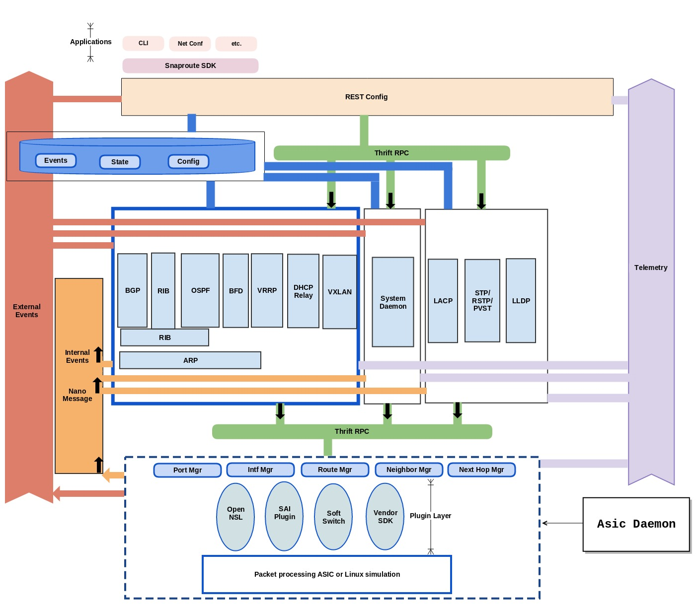

.. FlexSwitch_Asicd documentation master file, created by
   sphinx-quickstart on Tue May 17 03:59:34 2016.
   You can adapt this file completely to your liking, but it should at least
   contain the root `toctree` directive.

Welcome to FlexSwitch ASICd's documentation!
============================================

Overview

Snaproute's asic daemon serves as a hardware abstraction layer (HAL). A common northbound API interface is presented to all protocol daemons.
This interface allows provisioning a range of packet processing ASICs such as Broadcom, Mellanox, Cavium. Support for software simulation with docker instances is also provided.

Software Architecture

Northbound interface :

The asic daemons northbound interface is implemented using thrift RPC. This is the interface that is used by users/protocols to apply configuration.

Core resource managers :

The core infrastructure within Asicd is distributed across multiple resource managers, e.x. portMgr.go, routeMgr.go, neighborMgr.go etc. Each of these individual resource managers support Create/Retrieve/Update and Delete operations on the corresponding resource. These resource managers also maintain any relevant state data for each corresponding resource.

Plugins :

The asic daemon uses a plugin based approach to effectively abstract differences between ASICs from multiple vendors. The following plugins and asic vendors are currently supported

OpenNsl (Broadcom)
SAI (Mellanox, Barefoot)
Softswitch (Linux host)
Events handling :

The asicd daemon supports signaling/notification of asynchronous events. The notification engine employs a nano message based publisher. Notifications for the following events are supported

Port operational state changes
Vlan/Lag interface creation/deletion
IP interface operational state changes
