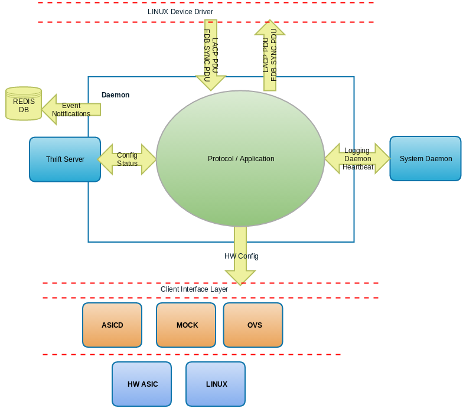

.. role:: red

Create Daemon Detailed Guide
============================

Detailed guide to create a new daemon within flexswitch

System Archetecture Overview
^^^^^^^^^^^^^^^^^^^^^^^^^^^^
When creating a daemon it is important to know some of the details.
Most if not all of the confuration backend is auto-generated based
on the configuration objects in the models repo.  Some of the 
design decisions regarding basic Daemon implementation revolve 
around the following key areas:

- Centralized DB: Redis DB
- Events / Notifications: Redis DB
- RPC: Thrift
- Linux OS: Don't are as all Daemons run in User Space
- Object Modeling (Config/State/Actions): Written as GO structures
  with different TAG's which help describe the struct member.
- Logging: stdout to Syslog

The following Repos are supported by flexswitch so first choose 
where your daemon code should be implemented:

- apps
- asicd *
- config *
- docs
- flexSdk
- infra
- l2 
- l3
- models *
- test
- utils
- reltools *

 :red:`* You will need to edit these repos as part of your work with a new daemon`.

Within the utils repo there are some utilities to help in aiding code re-use among
Daemons.  For example dmnBase provides a base class for your daemon to allow for
it to connect to ASICD, as well as L2 and L3 Daemons.   There is a common HAL 
implemented as part of asicdClient, which provides an interface class and the 
client implementations for the various interfaces.

Directory Structure
^^^^^^^^^^^^^^^^^^^
The following directories should be created within one of the above repos, all 
directories may not be necessary user discression is advised when deciding which you 
will be needing.  The reason for the separation is to make your module more modular 
which will also make it easier to test.

- <module>/rpc : Contains the Thrift Server implemention for your module for external
                 config / state /actions based on the model objects you create
- <module>/client : Contains external communcation with other Daemons and/or other
                    components which may be needed by your module that are not related
                    to the HAL.  For example RX/TX
- <module>/hal : Contains your modules interface to the HAL, this is important cause you
                 may want a HAL implementation that will not be included in 
                 utils/asicdClient
- <module>/server : Contains the interface to your module for configuration.
- <module>/protocol : Contains the bulk of your modules implementation
- <module>/main.go : Main routine for your module
- <module>/Makefile : Makefile to build your module, and rpc
                   
