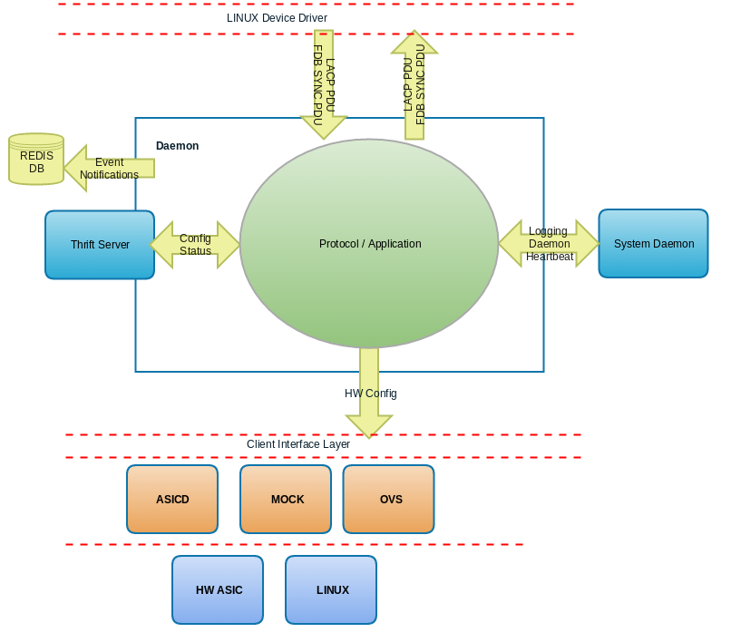

Quick Start Guide
=================
Quick start guide to create a new daemon within flexswitch

This guide helps you to create a small daemon skeleton which would run as part of FlexSwitch.
The daemon is named as Example Daemon.  This daemon is assumed to belong to layer 2
of the networking stack, so we make this daemon under $SR_CODE_BASE/src/l2

Create Model Objects
^^^^^^^^^^^^^^^^^^^^
First step in writing a daemon is to define the data model.

Our datamodel would consist of the objects that represent state and configuration of the daemon. 

Here we would create our model in a golang source file in $SR_CODE_BASE/models repo under objects directory.

File name for the below example **exampledObjects.go**

Example

::

 package objects
 
    /*
     * Config object of exampled
     */
    type Example struct {
        baseObj
        VlanId        int32    `SNAPROUTE: "KEY", ACCESS:"w", MULTIPLICITY: "*", MIN:"1", MAX: "4094", DESCRIPTION: "802.1Q tag/Vlan ID for vlan being provisioned"`
        IntfList      []string `DESCRIPTION: "List of interface names or ifindex values to  be added as tagged members of the vlan"`
        UntagIntfList []string `DESCRIPTION: "List of interface names or ifindex values to  be added as untagged members of the vlan"`
    }
    
    /*
     * State object of exampled
     */
     type ExampleState struct {
        baseObj
        VlanId        int32    `SNAPROUTE: "KEY", ACCESS:"r", MULTIPLICITY: "*", DESCRIPTION: "802.1Q tag/Vlan ID for vlan being provisioned"`
        IntfList      []string `DESCRIPTION: "List of interface names or ifindex values to  be added as tagged members of the vlan"`
        UntagIntfList []string `DESCRIPTION: "List of interface names or ifindex values to  be added as untagged members of the vlan"`
    }
    

Look at the "ACCESS" tag in above objects. 

An access type of "w" is considered as a configuration object and "r" as a state object.

Configuration objects can be created/updated/deleted, where as state objects can be only queried.

An object can have access type as "rw" as well. Objects with access type as "rw" are considered as configuration as well as state objects.

State objects should have "State" appended to the object name. E.g. ExampleState.

Add Model Object to Daemon Map
^^^^^^^^^^^^^^^^^^^^^^^^^^^^^^
Now that we have defined the model, we need to let the system know that the 'Example Daemon' is responsible for the functionality.
So we specify that these objects have an owner. As mentioned in the 'Architecture' section we use thrift as our RPC. So we need to specify
path to a generated thrift file.

Add the following lines to **models/objects/goObjinfo.json** before localObjects entry

Example

::

    "exampledOjects.go" :  {"owner":     "exampled",          
                           "location" : "l2/example/rpc",
                           "svcName"  : "nil"},           

Create Module source hierarchy
^^^^^^^^^^^^^^^^^^^^^^^^^^^^^^
Setup the directories for 'Example daemon' as follows

::

    mkdir l2/example
    cd l2/example 
    mkdir rpc
    mkdir server
    
Add module to thirft client handle
^^^^^^^^^^^^^^^^^^^^^^^^^^^^^^^^^^
ConfigManager in FlexSwitch needs to delegate the REST APIs to the new daemon. So we need to update the clients of ConfigManager

Add the following lines to **config/cliens/clientmap.go**

::

    "exampled":    &EXAMPLEDClient{},

Add module to client port list
^^^^^^^^^^^^^^^^^^^^^^^^^^^^^^
In addition to the ConfigManager there would be other modules like system daemon that would communicate with the new daemon.
To let the other daemons know the existance of 'Example Daemon' we need to update  
**config/params/clients.json** 

Pick a port number that does not conflict with any other port within the json. Make sure the port is not used by any other client or any service in your system.

Example

::

    {"Name":"exampled",
     "Port":10018},

Build Example Daemon Autogenerated Code
^^^^^^^^^^^^^^^^^^^^^^^^^^^^^^^^^^^^^^^

Example

::

    make codegen                                                      
    make ipc                                                          

Verify Components build properly
^^^^^^^^^^^^^^^^^^^^^^^^^^^^^^^^
- Verify that within l2/exampled/rpc directory that there is a thrift file **exampled.thrift** created.
      - For each object with access type as "w", there should be CreateXXX, UpdateXXX, and DeleteXXX APIs in EXAMPLEDServices thrift service.
      - For each object with access type as "r", there should be GetBulkYYY and GetYYY APIs in EXAMPLEDServices thrift service.
- Verify in models/objects that you see something similar to the following
    - gen_Exampledbif.go
    - gen_ExampleStatedbif.go
    - gen_exampledObjects_serializer.go
    - gen_exampledthriftutil.go
- Verify FlexSdk repo to see if APIs are generated for the above Objects in **flexSdk/py/flexprintV2.py** and **flexSdk/py/flexSwitchV2.py**

Create Main
^^^^^^^^^^^

Filename **example/main.go**

Example

::
    
    package main

    import (
            "l2/example/rpc"
            "l2/example/server"
            "strconv"
            "strings"
            "utils/dmnBase"
    )

    const (
            EXAMPLE_DMN_NAME = "exampled"
    )

    type exampleDaemon struct {
            *dmnBase.FSBaseDmn
            exampledServer *server.ExampledServer
            rpcServer      *rpc.RPCServer
    }

    var dmn exampleDaemon

    func main() {
            dmn.FSBaseDmn = dmnBase.NewBaseDmn(EXAMPLE_DMN_NAME, EXAMPLE_DMN_NAME)
            
            ok := dmn.Init()
            if !ok {
                    panic("Example Daemon Base initialization failed")
            }

            serverInitParams := &server.ServerInitParams{
                    DmnName:   EXAMPLE_DMN_NAME,
                    ParamsDir: dmn.ParamsDir,
                    DbHdl:     dmn.DbHdl,
                    Logger:    dmn.FSBaseDmn.Logger,
            }
        
            dmn.exampledServer = server.NewExampledServer(serverInitParams)
            go dmn.exampledServer.Serve()

            var rpcServerAddr string
            for _, value := range dmn.FSBaseDmn.ClientsList {
                    if value.Name == strings.ToLower(EXAMPLE_DMN_NAME) {
                            rpcServerAddr = "localhost:" + strconv.Itoa(value.Port)
                            break
                    }
            }
            if rpcServerAddr == "" {
                    panic("Example Daemon is not part of the system profile")
            }
        
            dmn.rpcServer = rpc.NewRPCServer(rpcServerAddr, dmn.FSBaseDmn.Logger)
            dmn.StartKeepAlive()

            // Wait for server started msg before opening up RPC port to accept calls
            _ = <-dmn.exampledServer.InitCompleteCh

            //Start RPC server
            dmn.FSBaseDmn.Logger.Info("Example Daemon Server started")
            dmn.rpcServer.Serve()
            panic("Example Daemon RPC Server terminated")
    }
                    

Create RPC Server
^^^^^^^^^^^^^^^^^
Create RPC Server to intercept RPC calls from Client.

Filename **l2/example/rpc/rpc.go**

Example

::
    
    package rpc

    import (
        "exampled"
        "git.apache.org/thrift.git/lib/go/thrift"
        "utils/logging"
    )   

    type rpcServiceHandler struct {
        logger logging.LoggerIntf
    }   

    func newRPCServiceHandler(logger logging.LoggerIntf) *rpcServiceHandler {
        return &rpcServiceHandler{
                logger: logger,
        }
    }   

    type RPCServer struct {
        *thrift.TSimpleServer
    }

    func NewRPCServer(rpcAddr string, logger logging.LoggerIntf) *RPCServer {
        transport, err := thrift.NewTServerSocket(rpcAddr)
        if err != nil {
                panic(err)
        }
        handler := newRPCServiceHandler(logger)
        processor := exampled.NewEXAMPLEDServicesProcessor(handler)
        transportFactory := thrift.NewTBufferedTransportFactory(8192)
        protocolFactory := thrift.NewTBinaryProtocolFactoryDefault()
        server := thrift.NewTSimpleServer4(processor, transport, transportFactory, protocolFactory)
        return &RPCServer{ 
                TSimpleServer: server,
        }
    }

Create RPC Service Handler for Example Object
^^^^^^^^^^^^^^^^^^^^^^^^^^^^^^^^^^^^^^^^^^^^^
Create the Create / Delete / Update / Get / GetBulk methods for the handler.

Filename **l2/example/rpc/rpcExampleHdl.go**
All these methods would be named based on the Name of the object. Our object is named as Example so the methods
are CreateExample, DeleteExample etc

Example

::

    package rpc

    import (
        "exampled"
    )

    func (rpcHdl *rpcServiceHandler) CreateExample(cfg *exampled.Example) (bool, error) {
        rpcHdl.logger.Info("Calling CreateExample", cfg)
        return true, nil
    }

    func (rpcHdl *rpcServiceHandler) UpdateExample(oldCfg, newCfg *exampled.Example, attrset []bool, op []*exampled.PatchOpInfo) (bool, error) {
        rpcHdl.logger.Info("Calling UpdateExample", oldCfg, newCfg)
        return true, nil
    }

    func (rpcHdl rpcServiceHandler) DeleteExample(cfg *exampled.Example) (bool, error) {
        rpcHdl.logger.Info("Calling DeleteExample", cfg)
        return true, nil
    }

    func (rpcHdl *rpcServiceHandler) GetExampleState(key int32) (obj *exampled.ExampleState, err error) {
        rpcHdl.logger.Info("Calling GetExampleState", key)
        return obj, err
    }

    func (rpcHdl *rpcServiceHandler) GetBulkExampleState(fromIdx, count exampled.Int) (*exampled.ExampleStateGetInfo, error) {
        var getBulkInfo exampled.ExampleStateGetInfo
        var err error
        //info, err := api.GetBulkExample(int(fromIdx), int(count))
        //getBulkInfo.StartIdx = fromIdx
        //getBulkInfo.EndIdx = exampled.Int(info.EndIdx)
        //getBulkInfo.More = info.More
        //getBulkInfo.Count = exampled.Int(len(info.List))
        // Fill in data, remember to convert back to thrift format
        //for idx := 0; idx < len(info.List); idx++ {
        //    getBulkInfo.ExampleList = append(getBulkInfo.ExampleList,
        //    convertToRPCFmtExample(info.List[idx]))
        //}
        return &getBulkInfo, err
    }
    

Create Module Server
^^^^^^^^^^^^^^^^^^^^
Create server file within ***l2/example/server/server.go***

Example

::

    package server
    
    import (
    	"utils/dbutils"
    	"utils/logging"
    )

    type ExampledServer struct {
        // store info related to server
        Logger		dbutils.DBIntf
        Logger		logging.LoggerIntf
        InitCompleteCh	chan bool
    }   
    
    type ServerInitParams struct {
        DmnName     string
        ParamsDir   string
        CfgFileName string
        DbHdl       dbutils.DBIntf
        Logger      logging.LoggerIntf
    }

    func NewExampledServer(initParams *ServerInitParams) *ExampledServer {
        srvr := ExampledServer{}
        
        srvr.DbHdl = initParams.DbHdl
        srvr.Logger = initParams.Logger
        srvr.InitCompleteCh = make(chan bool)

        // setup whatever you need for your server

        return &srvr
    }
    
    func (srvr *ExampledServer) Serve() {
        srvr.Logger.Info("Server initialization started")
        //err := srvr.initServer()
        //if err != nil {
        //      panic(err)
        //} 
        srvr.InitCompleteCh <- true
        srvr.Logger.Info("Server initialization complete, starting cfg/state listerner")
        for {
                //select {
                //case req := <-srvr.ReqChan:
                //      srvr.Logger.Info("Server request received - ", *req)
                //      srvr.handleRPCRequest(req)

                //}
        }
    }
    

Create Makefile for your module
^^^^^^^^^^^^^^^^^^^^^^^^^^^^^^^
We need to generate a binary for this module.  This can be done by 
creating a Makefile under l2/example/ directory.

Example

::

	RM=rm -f
	RMFORCE=rm -rf
	DESTDIR=$(SR_CODE_BASE)/snaproute/src/out/bin
	GENERATED_IPC=$(SR_CODE_BASE)/generated/src
	IPC_GEN_CMD=thrift
	SRCS=main.go
	IPC_SRCS=rpc/exampled.thrift
	COMP_NAME=exampled
	GOLDFLAGS=-r /opt/flexswitch/sharedlib
	all:exe 
	all:ipc exe
	ipc:
            $(IPC_GEN_CMD) -r --gen go -out $(GENERATED_IPC) $(IPC_SRCS)

	exe: $(SRCS) 
            go build -o $(DESTDIR)/$(COMP_NAME) -ldflags="$(GOLDFLAGS)" $(SRCS)

	guard:  
	ifndef SR_CODE_BASE
            $(error SR_CODE_BASE is not set)
	endif   

	install:
            @echo "OpticD has no files to install"
	clean:guard
            $(RM) $(DESTDIR)/$(COMP_NAME) 
            $(RMFORCE) $(GENERATED_IPC)/$(COMP_NAME)

Add Module to Top Level Repo Makefile
^^^^^^^^^^^^^^^^^^^^^^^^^^^^^^^^^^^^^
We want this module to be part of other l2 components. So edit Makefile under l2/ directory as follows.

Add the following line to COMPS

	example

Add the following lines to IPCS

	example
	

Package module into FlexSwitch
^^^^^^^^^^^^^^^^^^^^^^^^^^^^^^
We need to add ExampleDaemon to the top level Makefile so that it can be picked up for packaging
Make these changes on the top level Makefile as follows.

::

    install $(SRCDIR)/$(BUILD_DIR)/exampled $(DESTDIR)/$(EXT_INSTALL_PATH)/bin
    
    
Loading module to FlexSwitch
^^^^^^^^^^^^^^^^^^^^^^^^^^^^
Now we need to make the ExampleDaemon start on every FlexSwitch instantiation. 
This can be done by editing flexswitch script under $SR_CODE_BASE/reltools/ directory
as  follows. Make sure to change runlevel to avoid conflict.
    
 ::
       {'name': 'fMgrd',
        'runlevel' : 17, 
        'params': '-params=' + baseDir + '/params'},

       {'name': 'exampled',
        'runlevel' : 18, 
        'params': '-params=' + baseDir + '/params'},

       {'name': 'confd',
        'runlevel' : 19, 
        'params': '-params=' + baseDir + '/params'},

Now you should be able to see your daemon running as part of the FlexSwitch along with the other daemons.
  
