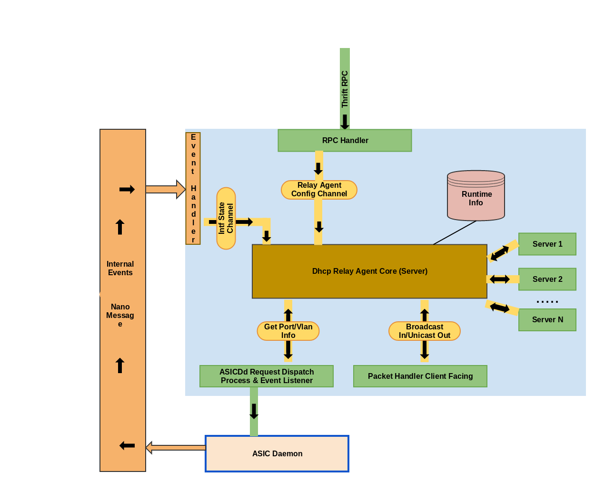

Dynamic Host Configuration Relay Agent
======================================

The protocol is standalone Process Daemon, with current dependencies with a configuration daemon CONFD and programability of HW Asic and/or Linux Kernel via ASICD

The Relay Agent will have an instance running per interface.

**Configuration**

Detailed information for the object can be found in models package The objects are created keeping in mind the basic Relay Agent Design.

Global Config to enable/disable Relay Agent across all interfaces
Create/Delete Relay Agent per interface
Configure Server's for Relay Agent

Architecture
************

**Support**

 - Receive DISCOVER Packet
 - Relay client Packet to all servers (configured) updating Relay Agent Information in Dhcp Options
 - Receive OFFER Packet
 - Send Unicast OFFER to Client (if configured) else Broadcast OFFER Packet
 - Receive REQUEST Packet
 - Relay REQUEST Packet to Server
 - Receive ACK Packet
 - Relay ACK Packet to Client
 - Snopping is NOT supported

**Future**
 - Relay Agent to Client needs to be Broadcast if client doesn't support unicast packet
 - Move to utils library for Flexswitch Asic

