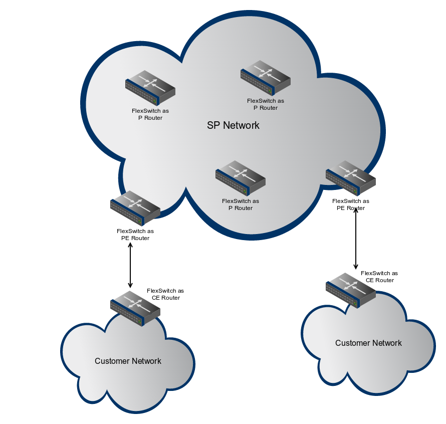

.. FlexSwitch documentation master file, created by
   sphinx-quickstart on Mon Apr  4 12:27:04 2016.
   You can adapt this file completely to your liking, but it should at least
   contain the root `toctree` directive.

White box networking in WAN
============================
This page describes how whitebox switch with Snaproute networking protocol suite (FlexSwitch) can be deployed in WAN topology. Service Provider network can be intercahngeably used as WAN. Below diagram depicts different router types in a Service Provider network where FlexSwitch can be deployed.

As shown above, FlexSwitch can be deployed as a P-Router, PE-Router, as well as a CE-Router.
